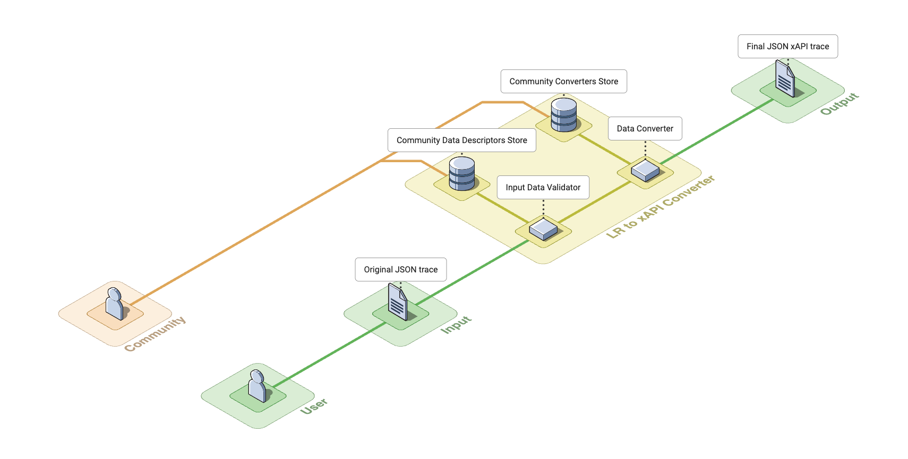
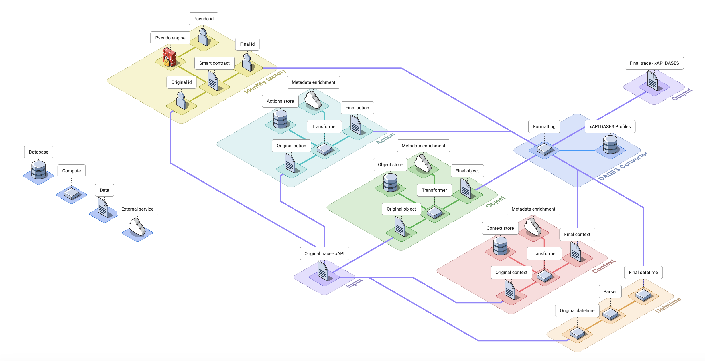

# Learning Records Converter (LRC)

## Overview

Learning Records are available in many formats, either standardized (xAPI, SCORM, IMS Caliper, cmi5) or proprietary (Google Classroom, MS Teams, csv, etc). This wide vairety of format is a barrier to many use cases of learning records as this prevent the easy combination and sharing of learning records datasets from multiple sources or organizations.

As a result, Inokufu was tasked, within the Prometheus-X ecosystem, to develop a **Learning Records Converter** which is a parser translating datasets of learning traces according to a common xAPI profile.

## Objectives and Expected Outcomes

The objective of this building block is to specify and develop APIs type "parser" to convert educational traces from one standard to another. Depending on the software and tools used in the field of education and training (LMS, LXP, ENT, etc.) several standards coexist in terms of data model of learning traces: SCORM, xAPI, cmi5, IMS Caliper, etc. This task will allow to combine learning traces data sets expressed in different standards.

This will allow, among other things, the aggregation of datasets (e.g. from LRS) in order to obtain either a larger volume of data or a follow-up of learning over a longer period of time and/or across several applications and educational platforms. These combined datasets will allow training of Machine Learning models on a scale that was previously impossible, except in situations of monopolistic data appropriation (e.g. Microsoft with Linkedin, Linkedin Learning and Teams).

Note that by nature, the aggregation of learning traces could pose problems of identification of the individuals concerned (i.e. the learners). Therefore, in alignment with the Anonymization and Pseudonymization task, the APIs of this task will de facto integrate anonymization and pseudonymization functionalities, with a particular vigilance for geographical data which are generally the weak points allowing de-anonymization.

## Approach

The **Learning Record Converter (LRC)** is a robust and flexible application designed to transform educational learning records from and into various formats. Tailored to adhere to the **Experience API (xAPI) Profile specification**, LRC facilitates a streamlined conversion process through a two-phase operation, which ensures that the input data is correctly interpreted, transformed, augmented, and validated to produce compliant JSON outputs.
The first phase converts a Learning Record from various input formats, into a single xAPI format. The second phase converts the xAPI learning records to ensure that they comply with the xAPI DASES Profiles.

Here is an architecture diagram illustrating the approach of the LRC to parse an input Learning Record in various standard, custom or unknown formats into an output Learning Record according to DASES xAPI profile.

### Phase 1: Learning Records to xAPI

The aim of this *first phase* is to convert a Learning Record to xAPI. In order to do this, we will set up two consecutive processes: Input Data Validation, and Data Transformation.
- **Input Data Validation** will be responsible for interpreting and validating the input data format (supplied in JSON format),
- **Data Transformation** will be in charge of transforming input data into xAPI format, where possible.

#### Input Data Validation

This component's role is to identify the format of the input Learning Record, and to validate that the records are valid.
Each dataset of Learning Records will have a metadata attribute stating the `input-format` of the learning record. This attribute will have one of the following values:

* `xapi`: learning record according to xAPI specification,
* `scorm`: learning record according to SCORM specification,
* `caliper`: learning record according to IMS caliper specification,
* `cmi5`: learning record according to cmi5 specification,
* `custom`: learning record according to a proprietary specification,
* `unknown`: learning record with an unknown format.

If the `input-format` is known, or if the `custom` data descriptor is given as input, the corresponding data descriptor will be loaded to validate Learning Records are compliant. Otherwise, every data descriptors will be loaded, and try to interpret learning records.

#### Data Transformation

This component's role is to convert the validated input data into the `xAPI` format.

Depending on the `input-format` of the learning records dataset, the processing will differ as follows:

* if the `input-format` is `xapi` (`cmi5` is considered a `xapi` profile, and is included in `xapi`), the conversion will be skipped.
* if the `input-format` is standard (`scorm`, `caliper`), the corresponding mapping will be used by the component to process the learning record. For each standard, there is a corresponding mapper which enables the formatting of the learning record into the `xapi` format.
* if the `input-format` is `custom`, then the Data Transformation module will look into its internal mappers and try to find a corresponding mapper able to convert from the detected input data format into `xapi`, or will require the data provider to provide a specific mapper from the `custom` format into the `xapi` format.
* if the `input-format` is `unknown`, then the Data Transformation module will do its best to automatically map each item of a learning record into the `xapi` format. Note this part will mainly rely on the AI matching sub-component of each component.

The first phase of the LRC is built with community collaboration in mind. It allows for **easy contributions and extensions** to both the input and output formats. The community can develop and share their own data descriptors and converters, which can be seamlessly integrated into the LRC's ecosystem, thereby enhancing the application's versatility to handle **various input and output formats**.

Here is a detailed architecture diagram illustrating the first phase of the LRC, to parse an input Learning Record in various standard, custom or unknown formats into an output Learning Record according to the xAPI standard.

These two consecutive processes can be summarized by this flow chart.

### Phase 2: xAPI to DASES

The aim of this *second phase* is to transform the xAPI Learning Record according to [DASES xAPI profiles](https://github.com/gaia-x-dases). 
The processing approach for this second phase is to break down each xAPI learning record in five key parts, then process each part to fit the [DASES xAPI profile](https://github.com/gaia-x-dases).

Here is a detailed architecture diagram illustrating the second phase of the LRC, to parse an input Learning Record in `xAPI` standard into an output Learning Record according to `DASES xAPI profiles`.

#### Actor identity component (AIC)Specifically

This component's role is to transform the `original-id` part of a learning record into a `final-id` that matches the `xAPI DASES profiles` and from which the personal data have been either suppressed (anonymized) or transformed (pseudonymized) based on the interaction with other dataspace's building blocks and in agreement with personal data regulations.

The AIC first step is to detect all the information related to the actor to which the Learning record is associated. Specifically, the component will extract user id, first name, last name, email address, postal address, username, phone number, birth date and birth place or any other identifier (SSN, social networks, etc).

Depending on the authorization the data consumer organization has, personal data will either be reformatted to fit the DASES xAPI profiles, or anonymized / pseudonymized depending on the cases and in accordance with european data regulations such as GDPR.

The anonymization and pseudonymization functionalities will rely in part on [Prometheus-X Anonymization and Pseudonymization building block](https://dataspace.prometheus-x.org/building-blocks/anonymization-pseudonymization).

#### Action verb component (AVC)

This component's role is to transform the `original-action` part of a learning record into a `final-action` according to `xAPI DASES profiles`.

The AVC component will suggest the most likely xAPI action verbs defined in xAPI DASES profiles, based on the `original-action` content.

#### Learning object component (LOC)

This component's role is to transform the `original-object` part of a learning record into a `final-object` according to the `xAPI DASES profiles`.

The LOC component will try to fill in as much information as possible in the object, according to `xAPI DASES profiles` based on the `original-object` content.

The LOC-enricher is a sub-component of the LOC, used to integrate with external Learning Object library/repository and being able to fetch more metadata about the `original-object` in order to enrich the metadata in the `final-object`.

#### Context component (COC)

This component's role is to transform the `original-context` part of a learning record into a `final-context` according to the `xAPI DASES profiles`.

The COC component will try to fill in as much information as possible in the context, according to `xAPI DASES profiles` based on the `original-context` content.

#### Datetime component (DTC)

This component's role is to transform the `original-datetime` part of a learning record into a `final-datetime` according to the `xAPI DASES profiles`.

The DTC component will suggest the most likely datetime according to the `xAPI DASES profiles` based on the `original-datetime` content.

#### Future improvements

The objective for the V1 of the LRC is to build the functionalities described above.

However, we have already in mind some potential improvement for the next version of the LRC:

* **Result**: in xAPI statement, the result part captures the outcome of the action. For instance, in the statement "John scored 85% on a quiz," '85%' would be the result. The ability to process the result part of a learning record will be a significant improvement.
* **Localization**: while the initial version will only support English language (EN), it will be very interesting to add the possibility to localize a data set of learning records in other languages, both in input and output.

## Project status

Please note this project is work in progress.

* [x] State of the art of the latest evolutions of learning traces standards
* [x] Quantitative inventory of the main software learning outcomes standards and tools used in the field of education and training in France and in Europe from the list identified in the working groups of the Data space Education & Skills (i.e. SCORM, xAPI, cmi5, IMS Caliper)
* [ ] Definition of the architecture of the API endpoints in accordance with the technical recommendations of GAIA-X
* [ ] Development of the endpoints necessary for parsing the various priority standards identified above
* [ ] Integration of anonymization/pseudonymization features expression of data in JSON-LD format to ensure interoperability with other data spaces
* [ ] API testing with model datasets provided by Prometheus volunteer partners
* [ ] De-anonymization tests of learning traces (in connection with the task Anonymization and Pseudonymization)
* [ ] Deployment of the service in a managed version in one of the partner cloud providers
* [ ] Development of automated service deployment scripts for multi-cloud use (infrastructure as code e.g. Terraform) at partner cloud providers
* [ ] Drafting of the public documentation, hosting and putting it online

## Roadmap

Here are the key milestones of the project:

* 2023 Q3: Start of development of the learning records converter
* 2023 Q4: Integrate work on common DASES xAPI profile (see https://github.com/gaia-x-dases)
* 2024 Q1: Launch V0 of the learning records converter
* 2024 Q2: Launch V1 of the learning records converter

## Interoperability of Learning Records: State-of-the-Art in 2023

As a preparatory work for the development of the Learning Records Converter, Inokufu has conducted an exhaustive state of the art and quantitative study about the interoperability of Learning records.

This study is available [here](https://github.com/Prometheus-X-association/learning-records-interoperability-2023)

## Setup and installation

> ToDo: this part will be completed when the first stable version of the code will be released.

## Contribution guidelines

We welcome and appreciate contributions from the community! There are two ways to contribute to this project:

* If you have a question or if you have spotted an issue or a bug, please start a new issue in this repository.
* If you have a suggestion to improve the code or fix an issue, please follow these guidelines: 
  1. **Fork the Repository**: Fork the Learning Records Converter repository to your own GitHub account.
  2. **Create a Branch**: Make a new branch for each feature or bug you are working on.
  3. **Make your Changes**: Implement your feature or bug fix on your branch.
  4. **Submit a Pull Request**: Once you've tested your changes, submit a pull request against the Learning Records Converter's `master` branch.

Before submitting your pull request, please ensure that your code follows our coding and documentation standards. Don't forget to include tests for your changes!

## References

<https://gaia-x.eu/gaia-x-framework/>

<https://prometheus-x.org/>

<https://dataspace.prometheus-x.org/building-blocks/interoperability/learning-records>
