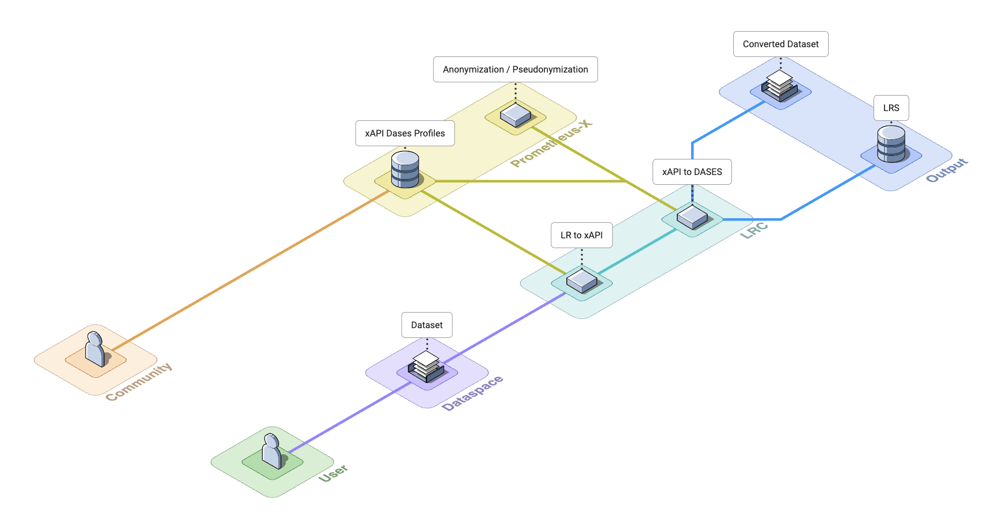

# Learning Records Converter (LRC)

## Overview

Learning Records are available in many formats, either standardized (xAPI, SCORM, IMS Caliper, cmi5) or proprietary (Google Classroom, MS Teams, csv, etc). This wide variety of formats is a barrier to many use cases of learning records as it prevents the easy combination and sharing of learning records datasets from multiple sources or organizations.

As a result, Inokufu was tasked, within the Prometheus-X ecosystem, to develop a **Learning Records Converter** which is a parser translating datasets of learning traces according to common xAPI profiles.

## Approach

LRC facilitates a streamlined conversion process through a two-phase operation, which ensures that the input data is correctly interpreted, transformed, augmented, and validated to produce compliant JSON outputs.
The first phase converts a Learning Record from various input formats, into a single xAPI format. The second phase converts the xAPI learning records to ensure that they comply with the xAPI DASES Profiles.

Here is an architecture diagram illustrating the approach of the LRC to parse an input Learning Record in various standard, custom or unknown formats into an output Learning Record according to DASES xAPI profile.




### Phase 1: Learning Records to xAPI

The aim of this *first phase* is to convert a Learning Record to xAPI. In order to do this, we will set up two consecutive processes: Input Data Validation, and Data Transformation.
- **Input Data Validation** will be responsible for interpreting and validating the input data format (supplied in JSON format),
- **Data Transformation** will be in charge of transforming input data into xAPI format, where possible.

#### Input Data Validation

This component's role is to identify the format of the input Learning Record, and to validate that the records are valid.
Each dataset of Learning Records will have a metadata attribute stating the `input-format` of the learning record. 

If the `input-format` is known, the corresponding data descriptor will be loaded to validate Learning Records are compliant. Otherwise, every data descriptors will be loaded, and try to interpret learning records.

#### Data Transformation

This component's role is to convert the validated input data into the `xAPI` format.

Depending on the `input-format` of the learning records dataset, the processing will differ as follows:

* if the `input-format` is `xapi` (cmi5 is considered a `xapi` profile), the conversion will be skipped.
* if the `input-format` is standard (scorm, ims_caliper), the corresponding mapping will be used by the component to process the learning record. For each standard, there is a corresponding mapper which enables the formatting of the learning record into the `xapi` format.
* if the `input-format` is unknown, then the Data Transformation module will do its best to automatically map each item of a learning record into the `xapi` format. 

The first phase of the LRC is built with community collaboration in mind. It allows for **easy contributions and extensions** to both the input and output formats. The community can develop and share their own data descriptors and converters, which can be seamlessly integrated into the LRC's ecosystem, thereby enhancing the application's versatility to handle **various input and output formats**.

Here is a detailed architecture diagram illustrating the first phase of the LRC, to parse an input Learning Record in various standard, custom or unknown formats into an output Learning Record according to the xAPI standard.


These two consecutive processes can be summarized by this flow chart.


### Phase 2: xAPI to DASES

The aim of this *second phase* is to transform the xAPI Learning Record according to [DASES xAPI profiles](https://github.com/gaia-x-dases). 

Each profile is defined in a JSON-LD file and includes specific concepts, extensions, and statement templates that guide the transformation and validation of xAPI statements.
The DASES profiles in JSON-LD format are automatically downloaded and updated from their respective GitHub repositories as defined in the `.env` file.

The LRC **enriches** xAPI statements with profile-specific data, **validates** statements against profile rules, and give **recommendations** for improving compliance with the profiles.

This ensures that the converted learning records are not just in xAPI format, but also adhere to the specific DASES profile standards, enhancing interoperability and consistency across different learning systems.

##### Enriched Fields
  - `verb.id`: Set to the appropriate verb URI (e.g., "https://w3id.org/xapi/netc/verbs/accessed" for accessing a page)
  - `verb.display.en-US`: Human-readable description of the verb
  - `object.definition.type`: Set to the appropriate activity type URI
  - `context.contextActivities.category`: Includes a reference to the associated profile

#### DASES Profiles in Detail

The LRC currently supports theses main profiles :

##### LMS Profile
- **Purpose**: Standardizes tracking of common LMS activities.
- **Key Concepts**: Includes verbs like 'accessed', 'downloaded', 'registered', and 'uploaded'.
- **Activity Types**: Covers webpages, files, courses, and various media types.
- **Extensions**: Provides context for activities like file types, session IDs, and user roles.

##### Forum Profile
- **Purpose**: Captures forum-specific interactions in learning environments.
- **Key Concepts**: Includes verbs related to posting, replying, and viewing forum content.
- **Activity Types**: May cover forum threads, posts, and user interactions.

##### Assessment Profile
- **Purpose**: Tracks assessment-related activities and results.
- **Key Concepts**: Includes verbs like 'started', 'terminated', and 'completed'.
- **Activity Types**: Covers different types of assessments and question formats.


## Setup and installation

### Getting Started

#### Prerequisites

- Python 3.12 (Note: The project is developed and tested with Python 3.12. It may work with later versions, but this is not guaranteed.)

#### Installation

1. Clone the repository:
   ```
   git clone [repository_url]
   cd [project_directory]
   ```

2. Install pipenv if you haven't already:
   ```
   pip install pipenv
   ```

3. Install the project dependencies:
   ```
   pipenv install
   ```

4. Set up environment variables:
   Create a `.env` file in the project root by copying `.env.default`:
   ```
   cp .env.default .env
   ```
   You can then modify the variables in `.env` as needed.

### Usage

#### Running the Application

Start the FastAPI server using the script defined in Pipfile:
```
pipenv run start
```

The API will be available at `http://localhost:8000`.

#### Converting Traces

To convert a trace, send a POST request to the `/convert` endpoint:

```
POST /convert
Content-Type: application/json

{
  "input_trace": {
    // Your input trace data here
  },
  "input_format": "<input_format>"
}
```

Supported input formats:
- xapi
- imscaliper1_2
- imscaliper1_1
- scorm_2004

Response format:

```json
{
  "output_trace": {
    // Converted xAPI trace data
  },
  "meta": {
    "input_format": "<input_format>",
    "recommendations": [
      {
        "rule": "presence",
        "path": "$.result.completion",
        "expected": "included",
        "actual": "missing"
      }
    ]
  }
}
```

#### Validating Traces

This endpoint validates the input trace and returns the confirmed input format. If the validation fails, an appropriate error response will be returned instead.
Send a POST request to the `/validate` endpoint:

```
POST /validate
Content-Type: application/json

{
  "input_trace": {
    // Your input trace data here
  },
  "input_format": "<input_format>"
}
```

Response format:

```json
{
  "input_format": "<input_format>"
}
```

#### API Documentation

Once the server is running, you can access the interactive API documentation:

- Swagger UI: Available at `/docs`
- ReDoc: Available at `/redoc`

These interfaces provide detailed information about all available endpoints, request/response schemas, and allow you to test the API directly from your browser.


### Development

#### Code Formatting and Linting

The project uses Black for code formatting, Flake8 for linting, and isort for import sorting. You can run these tools using their respective commands in the pipenv environment.

#### Mapping

To understand how mapping works or to create your own mapping, a document is available [here](./docs/1_mapping.md).

#### Project Architecture

An explanation of how the project is organised is available [here](./docs/2_project_architecture.md).

### Environment Variables

The following table details the environment variables used in the project:

| Variable | Description | Required | Default Value | Possible Values |
|----------|-------------|----------|---------------|-----------------|
| LOG_LEVEL | Minimum logging level for the application | No | info | debug, info, warning, error, critical |
| DOWNLOAD_TIMEOUT | Timeout for downloading profiles (in seconds) | No | 10 | Any positive integer |
| CORS_ALLOWED_ORIGINS | Allowed origins for CORS | No | * | Comma-separated list of origins or * for all |
| PROFILES_BASE_PATH | Base path for storing profile files | Yes | data/dases_profiles | Any valid directory path |
| PROFILES_NAMES | Names of the profiles to be used | Yes | lms,forum,assessment | Comma-separated list of profile names |
| PROFILE_LMS_URL | URL for the LMS profile JSON-LD file | Yes | https://raw.githubusercontent.com/gaia-x-dases/xapi-lms/master/profile/profile.jsonld | Any valid URL |
| PROFILE_FORUM_URL | URL for the Forum profile JSON-LD file | Yes | https://raw.githubusercontent.com/gaia-x-dases/xapi-forum/master/profile/base.jsonld | Any valid URL |
| PROFILE_ASSESSMENT_URL | URL for the Assessment profile JSON-LD file | Yes | https://raw.githubusercontent.com/gaia-x-dases/xapi-assessment/add-mandatory-statements/profile/profile.jsonld | Any valid URL |

Note: The URLs for the profiles are examples and may change. Always use the most up-to-date URLs for your project.

Refer to `.env.default` for a complete list of configurable environment variables and their default values.


## Contribution guidelines

We welcome and appreciate contributions from the community! There are two ways to contribute to this project:

* If you have a question or if you have spotted an issue or a bug, please start a new issue in this repository.
* If you have a suggestion to improve the code or fix an issue, please follow these guidelines: 
  1. **Fork the Repository**: Fork the Learning Records Converter repository to your own GitHub account.
  2. **Create a Branch**: Make a new branch for each feature or bug you are working on.
  3. **Make your Changes**: Implement your feature or bug fix on your branch.
  4. **Submit a Pull Request**: Once you've tested your changes, submit a pull request against the Learning Records Converter's `master` branch.

Before submitting your pull request, please ensure that your code follows our coding and documentation standards. Don't forget to include tests for your changes!

## Project status

Please note this project is work in progress.

* [x] State of the art of the latest evolutions of learning traces standards
* [x] Quantitative inventory of the main software learning outcomes standards and tools used in the field of education and training in France and in Europe from the list identified in the working groups of the Data space Education & Skills (i.e. SCORM, xAPI, cmi5, IMS Caliper)
* [x] Definition of the architecture of the API endpoints in accordance with the technical recommendations of GAIA-X
* [x] Development of the endpoints necessary for parsing the various priority standards identified above
* [ ] API testing with model datasets provided by Prometheus volunteer partners
* [ ] Deployment of the service in a managed version in one of the partner cloud providers
* [ ] Development of automated service deployment scripts for multi-cloud use (infrastructure as code e.g. Terraform) at partner cloud providers
* [ ] Drafting of the final public documentation


## Interoperability of Learning Records: State-of-the-Art in 2023

As a preparatory work for the development of the Learning Records Converter, Inokufu has conducted an exhaustive state of the art and quantitative study about the interoperability of Learning records.

This study is available [here](https://github.com/Prometheus-X-association/learning-records-interoperability-2023)


## References

<https://gaia-x.eu/gaia-x-framework/>

<https://prometheus-x.org/>

<https://dataspace.prometheus-x.org/building-blocks/interoperability/learning-records>
