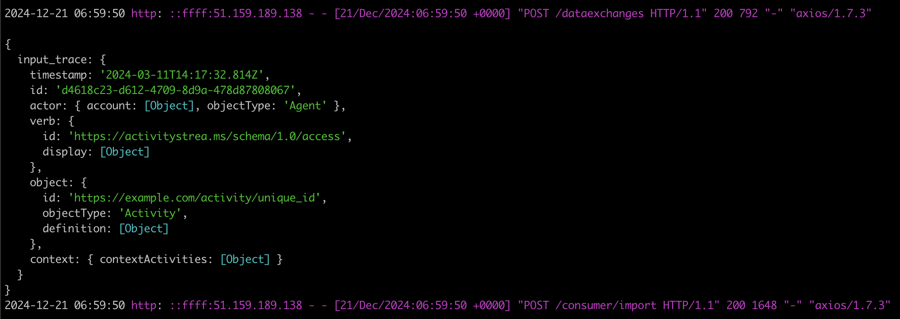

# Connection with the Dataspace

## Overview
Integrating the LRC API with the Education Dataspace is crucial to maximizing the potential of educational data exploitation. By linking these two systems, we can ensure a continuous flow of data, enabling partners to use the LRC deployed on Inokufu's servers while remaining within the Dataspace ecosystem. It also facilitates interoperability, making it easier for educational institutions and technology providers to adopt and implement new technologies with minimal friction. Ultimately, this integration enhances the ability to personalize learning experiences, improve educational strategies and support data-driven decision-making in education.

## Approach
This connection to the dataspace is made in 2 steps:
- Configurations in the Vision Trust catalog
- PDC integration

## Configurations in the Vision Trust catalog
Steps to follow for the data provider, partner wishing to use the LRC:
1. Creating a data set or service (if it is an API)
2. Creation of an offering linked to the data set
3. Creation of a project linked to the offering

Steps to follow for the service provider, partner proposing the LRC:
1. Creating a service
2. Creation of an offering linked to the service

Steps to follow for contractualization
1.  Data provider sends a contract negotiation request
2.  Service provider accepts contract negotiation
3.  Data provider signs contract
4.  Service provider signs contract

## PDC integration
To integrate the PDC into the LRC, we followed the [indications](https://github.com/Prometheus-X-association/dataspace-connector).

Data flow: 
1. Data provider wants to convert his data; he sends a conversion request from his PDC, via a POST /consumer/exchange call, mentioning his contract and the associated service.
2. His PDC does its job, then sends its data to service provider.
3. Service provider's PDC does its job, then sends the conversion request to the service configured in the Catalog (the LRC).
4. The LRC converts the data, then sends it back to its PDC (service provider), which in turn sends it back to data provider's PDC.
5. The data is then sent to wherever the Data Provider wishes (to be configured in the PDC).


## Test of exchange
To demonstrate this integration, we have carried out an exchange between 2 accounts in the vision trust catalog.

### Data provider : Inokufu Test Partner 1
Inokufu Test Partner 1 : http://51.159.189.138:3002/docs \
The data provider is the organization that will call on the LRC via dataspace.

1. Creating a data set \
20241206 data to convert \
The trace is stored in a file on S3 (could also be retrieved by a Data Provider API)
```json
{
  "input_trace": {
    "timestamp": "2024-03-11T14:17:32.814Z",
    "id": "d4618c23-d612-4709-8d9a-478d87808067",
    "actor": {
      "account": {
        "homePage": "https://example.edu/",
        "name": "554433"
      },
      "objectType": "Agent"
    },
    "verb": {
      "id": "https://activitystrea.ms/schema/1.0/access",
      "display": {
        "en-US": "Accessed"
      }
    },
    "object": {
      "id": "https://example.com/activity/unique_id",
      "objectType": "Activity",
      "definition": {
        "name": {
          "en-US": "1EdTech Caliper Implementation Guide, pg 5"
        },
        "description": {
          "en-US": "No description provided"
        },
        "type": "https://w3id.org/xapi/acrossx/activities/webpage",
        "extensions": {
          "https://w3id.org/xapi/acrossx/extensions/type": "course"
        }
      }
    },
    "context": {
      "contextActivities": {
        "category": {
          "id": "https://toto.org",
          "definition": {
            "type": "http://tata.org"
          }
        }
      }
    }
  }
}
```
   


2. Creation of an offering linked to the data set \
20241206 Convert my data : https://visionstrust.com/dashboard/catalog/offers/6752dc8d014a7bc91047c7dd 


3. Creation of a project linked to the offfering \
20241206 Conversion project : https://visionstrust.com/dashboard/my-projects/6752dbbc014a7bc91047b4ea 


### Service provider : Inokufu Test Partner 2
Inokufu Test Partner 2 : http://51.159.185.0:3002/docs \
The service provider is the LRC called by the data provider.

1. Creating a service \
20241206 Learning Records Converter service \
This service is directly linked to the LRC.


2. Creation of an offering linked to the service \
20241206 Learning Records Converter : https://visionstrust.com/dashboard/my-offers/6752c9c0014a7bc910476f91


### Contract between Inokufu test Partner 1 and Inokufu test Partner 2
In order to provoke an exchange, we have drawn up a contract between the Inokufu Test Partner 1 project and the Inokufu Test Partner 2 offering. \
ID contract : 6752dbbc58622125191d4513.


### Exchange
Data flow is as follows: 
- Inokufu Test Partner 1 (data provider) wants to convert his data; he sends a conversion request from his PDC, via a POST /consumer/exchange call, mentioning his contract and the associated service.
- His PDC does its job, then sends its data to Inokufu Test Partner 2's PDC (service provider).
- Inokufu Test Partner 2's PDC (service provider) does its job, then sends the conversion request to the service configured in the Catalog (the LRC).
- The LRC converts the data, then sends it back to its PDC (Inokufu Test Partner 2, service provider), which in turn sends it back to Inokufu Test Partner 1's PDC (Data Provider).
- The data is then sent to wherever the Data Provider wishes (to be configured in the PDC).


We run a payload — A POST dans /consumer/exchange , in the Inokufu Test Partner 1 PDC.
```json
  {
    "contract": "https://contract.visionstrust.com/contracts/6752dbbc58622125191d4513",
    "resourceId": "https://api.visionstrust.com/v1/catalog/serviceofferings/6752dc8d014a7bc91047c7dd",
    "purposeId": "https://api.visionstrust.com/v1/catalog/serviceofferings/6752c9c0014a7bc910476f91"
  }
```

#### Validation in the Inokufu test Partner 2 PDC (service provider)
In this image, we can see what has been retrieved from the Data API (in our case, a JSON file), which will then be sent to the LRC's PDC.


#### Validation in the Inokufu test Partner 1 PDC (data provider)


## Conclusion
In conclusion, the integration of the PDC into the LRC is very efficient and enables data exchange in dataspace.
